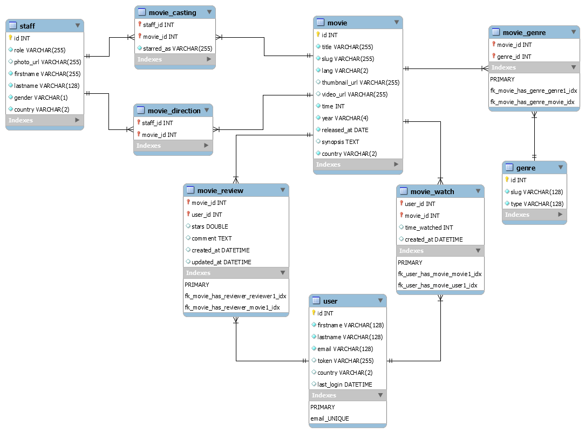

# Videoflix

##  Modelisation et conception de base de données

Videoflix est une plateforme de streaming vidéo qui permet de consulter des films à raison de 600 minutes par mois et par utilisateur.
La plateforme est accessible uniquement à travers un e-mail et propose des films en tous genres en version originale.

Les films les mieux notés, les films récemment sortis en salle et les films locaux selon le pays de l'utilisateur sont mis en avant. 
Il se peut aussi qu'un film non sorti en salle soit référencé auprès de Videoflix.

Un moteur de recherche avancée permet un recherche intuitif au contenu, que ce soit sur les informations techniques du film (films, casting, membres de la production) ou sa popularité.

Une fiche technique du film est disponible, elle possède :
* une vignette
* un synopsis
* la durée
* le casting ainsi que les rôles joués dans le film
* les membres de la direction

Pour finir l'utilisateur pourra attribuer une note au film ainsi qu'un commentaire s'il le souhaite.

### Schema MCD (Modèle conceptuel des données)


### Schema base de données 


#### Remarque: 
Nous nous appuierons sur des données normalisées pour le pays et la langue 
[ISO-3166 Country Codes and ISO-639 Language Codes](https://docs.oracle.com/cd/E13214_01/wli/docs92/xref/xqisocodes.html)


## Environnement

Cet environnement fournit une base de données mysql avec un jeu de données ainsi que phpmyadmin

### Pré-requis

Téléchargement: https://docs.docker.com/get-docker/

* Docker (minimum version 18.06)
* Docker-compose (minimum version 1.25.0)

Merci de vérfier les pré-requis avec la commande suivante

```bash
$ docker -v
``` 

```bash
$ docker-compose -v
``` 
En savoir plus:
* https://docs.docker.com/compose/
* https://docs.docker.com/compose/compose-file/


### Lancer l'environnement

```bash
$ docker-compose up -d
```

### Lister vos containers

```bash
$ docker-compose ps
    Name               Command                 State             Ports
---------------------------------------------------------------------------------------------
phpmyadmin     /docker-entrypoint.sh apac ...   Up      0.0.0.0:8080->80/tcp
videoflix_db   docker-entrypoint.sh mysqld      Up      0.0.0.0:6606->3306/tcp, 33060/tcp
```

### Ouvrir phpmyadmin sur un navigateur
http://localhost:8080

```
user: root
password: password
``` 


## Requêtes SQL
Ci joint l'ensemble des requêtes à executer

### Requête niveau basique

1 - Écrire une requête qui retourne le nom et l'année des films

2 - Écrire une requête qui retourne l'année de sortie du film American Beauty

3 - Écrire une requête qui retourne le(s) film(s) sorti en 1999.

4 - Écrire une requête qui retourne le(s) film(s) sortis avant 1998.

5 - Écrire une requête qui retourne le nom de tous les utilisateurs qui ont commenté des films

6 - Écrire une requête qui retourne le nom de tous les utilisateurs qui ont attribué 6 étoiles ou plus à un film

7 - Écrire une requête qui retourne les titres de tous les films qui n'ont pas de notes.

8 - Écrire une requête qui retourne les titres des films avec les ID 5, 6, 8

9 - Écrire une requête qui retourne une liste de film avec l'annéedont le titre des films contient les mots "Boogie" ou "Nights".

10 - Écrire une requête qui retourne l'ID d'un acteur ou membre de la direction dont le prénom est 'Woody' et le nom de famille est 'Allen'

### Requête niveau normal

1 - Écrire une requête en SQL pour lister toutes les informations des acteurs qui ont joué un rôle dans le film «Annie Hall».

2 - Écrire une requête en SQL pour trouver le nom du réalisateur (prénom et nom) qui a réalisé un film qui a joué un rôle pour «Eyes Wide Shut». (en utilisant une sous-requête)

3 - Écrire une requête en SQL pour répertorier tous les films qui ne sont pas américain.

4 - Écrire une requête en SQL pour trouver le titre du film, l'année, la date de sortie, le réalisateur et l'acteur des films dont le critique est inconnu.

5 - Écrire une requête en SQL pour trouver le titre du film, l'année, la date de sortie, le réalisateur et l'acteur des films dont le critique est connu.

6 - Écrire une requête en SQL pour trouver les titres de tous les films réalisés par le réalisateur dont le prénom et le nom sont Woddy Allen.

7 - Écrire une requête en SQL pour trouver les années ou au moins un film a été produit et qui ont reçu une note de plus de 3 étoiles. Afficher les résultats par ordre croissant

8 - Écrire une requête en SQL pour trouver les titres de tous les films qui n'ont pas de notes

9 - Écrire une requête en SQL pour trouver les noms de tous les utlisateurs qui n'ont pas noté

10 - Écrire une requête en SQL pour trouver les utilisateurs qui ont noté plus d'un film.

11 - Écrire une requête en SQL pour trouver le titre du film qui a le grand nombre d'étoiles par genre et le titre du film apparaît par ordre alphabétique dans l'ordre croissant.

12 - Écrire une requête en SQL pour trouver les noms de tous les utilisateurs qui ont évalué le film American Beauty.

13 - Écrire une requête en SQL pour lister le prénom et le nom de tous les acteurs qui ont été castés dans le film «Annie Hall», ainsi que les rôles qu'ils ont joué dans cette production.

14 - Écrire une requête en SQL pour trouver le nom du film et du réalisateur (prénom et nom) qui a réalisé un film qui a joué un rôle pour "Eyes Wide Shut"

15 - Écrire une requête en SQL pour trouver le nom du film et du réalisateur (prénom et nom) qui ont réalisé un film qui a joué le rôle de Sean Maguire.

16 - Écrire une requête en SQL pour lister tous les acteurs qui n'ont joué dans aucun film entre 1990 et 2000.

17 - Écrire une requête en SQL pour lister le prénom et le nom de tous les réalisateurs avec le nombre de genres de films dirigés avec le nom des genres, et classer le résultat par ordre alphabétique avec le prénom et le nom du réalisateur.

18 - Écrire une requête en SQL pour lister tous les films avec l'année et les genres

19 - Écrire une requête en SQL pour répertorier tous les films avec l'année, les genres et le nom du réalisateur.

20 - Écrire une requête en SQL pour lister tous les films avec le titre, l'année, la date de sortie, la durée du film et le prénom et le nom du réalisateur sortis avant le 1er janvier 1989, et triez l'ensemble des résultats en fonction de la date de sortie de la date la plus récente à la plus ancienne

21 - Écrire une requête en SQL pour calculer un rapport contenant les genres de ces films avec leur durée moyenne et le nombre de films pour chaque genre

22 - Écrire une requête en SQL pour générer un rapport indiquant l'année de production de la plupart des films "Mystery", le nombre de films et leur note moyenne.


